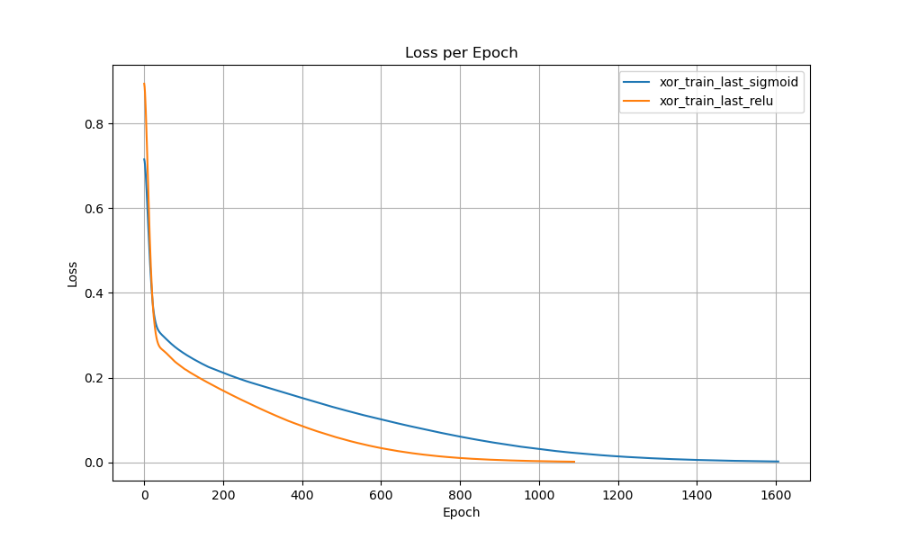
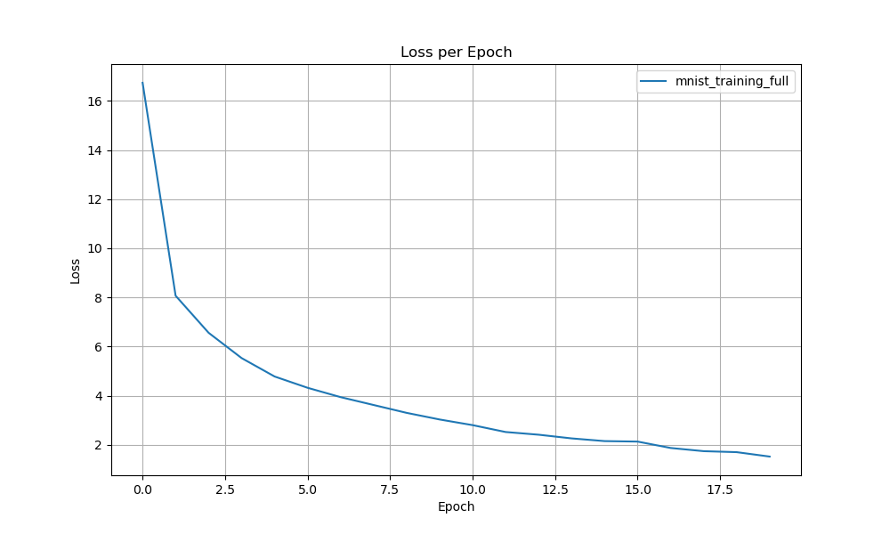

# Simple dl

This is a simple project to teach myself some of the concepts of deep learning. The goal is to create a simple library for dl completely from scratch. 

## Features
- [x] Tensors with basic operations and autograd
- [x] Linear and Sequential models
- [x] ReLU, Softmax, and Sigmoid activation functions
- [x] MNIST dataset loader
- [x] SDG with momentum optimizer
- [x] examples for training a linear function, XOR function, and MNIST dataset
- [ ] Convolutional layers
- [ ] RNN layers
- [ ] LSTM layers
- [ ] GRU layers
- [ ] Batch normalization
- [ ] Dropout
etc.
## Example

### Linear function training example
Given the following network:    
```cpp
Linear* linear1 = new Linear(3, 5);
ReLU* act1 = new ReLU();
Linear* linear2 = new Linear(5, 1);

Sequential simple_network({linear1, act1, linear2});
```
The following graph is obtained when training the above model to a linear function:

**See the example in the `example/simple_network.cpp` file.**

### XOR function training example

Given the following network:    
```cpp
// create a simple network
Linear* linear1 = new Linear(2, 10);
ReLU* act1 = new ReLU();
Linear* linear2 = new Linear(10, 1);


Sequential simple_network({linear1, act1, linear2});
```
The following graph is obtained when training the above model to the XOR function:


**See the example in the `example/simple_network_xor.cpp` file.**

### MNIST training example

Given the following network:    
```cpp
    Flatten* flatten = new Flatten();
    Linear* linear1 = new Linear(784, 128);
    ReLU* act1 = new ReLU();
    Linear* linear2 = new Linear(128, 64);
    ReLU* act2 = new ReLU();
    Linear* linear3 = new Linear(64, 10);
    Softmax* output = new Softmax();

    Sequential simple_network({flatten, linear1, act1, linear2, act2, linear3, output});
```

The following graph is obtained when training the above model to a single data point from the MNIST dataset:

This example was trained for 20 epochs with a batch size of 50 and a learning rate of 0.001. It reached an accuracy of 0.99 on the test set.

**See the example in the `example/mnist_example.cpp` file.**

## Build
```bash
mkdir build
cd build
cmake ..
make
# run the example e.g.
./simple_network
```
## Run tests
```bash
./test_tensors && ./test_gradients && ./test_linear_model 
```

