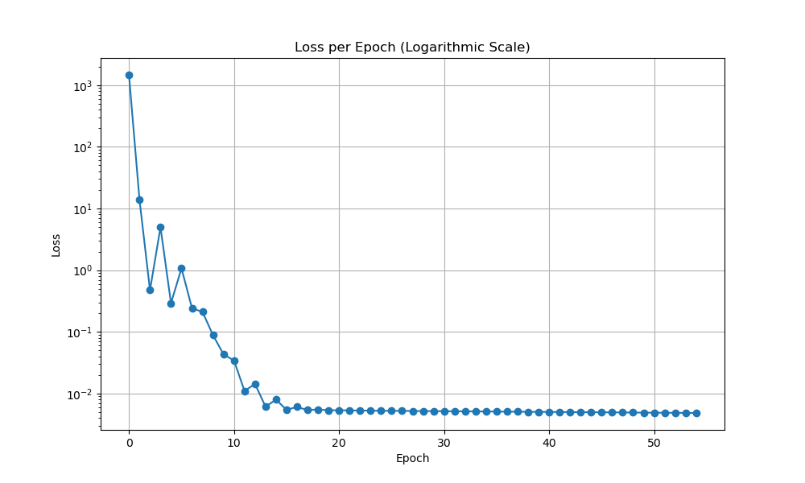

# Simple dl

This is a simple project to teach myself some of the concepts of deep learning. The goal is to create a simple framework for dl completely from scratch. 

The current implementation computes the gradients very inefficiently and it is not optimized in any way.

## Example
Given the following network:    
```cpp
Linear* linear1 = new Linear(3, 5);
ReLU* act1 = new ReLU();
Linear* linear2 = new Linear(5, 1);

Sequential simple_network({linear1, act1, linear2});
```
We obtain the following graph when fitting it to a linear function:



**See the example in the `example/simple_network.cpp` file.**
