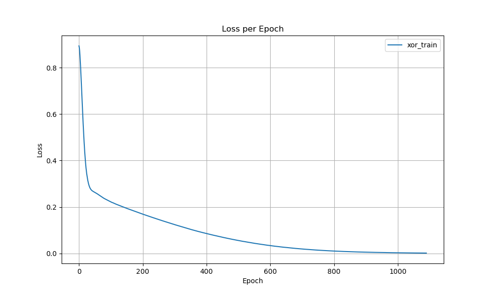

# Simple dl

This is a simple project to teach myself some of the concepts of deep learning. The goal is to create a simple library for dl completely from scratch. 

The current implementation computes the gradients very inefficiently and it is not optimized in any way.

## Example

### Linear function fitting
Given the following network:    
```cpp
Linear* linear1 = new Linear(3, 5);
ReLU* act1 = new ReLU();
Linear* linear2 = new Linear(5, 1);

Sequential simple_network({linear1, act1, linear2});
```
The following graph is obtained when fitting the above model to a linear function:

**See the example in the `example/simple_network.cpp` file.**

### XOR function fitting

Given the following network:    
```cpp
// create a simple network
Linear* linear1 = new Linear(2, 10);
ReLU* act1 = new ReLU();
Linear* linear2 = new Linear(10, 1);
ReLU* act2 = new ReLU();
// Sigmoid* act2 = new Sigmoid();


Sequential simple_network({linear1, act1, linear2});
```
The following graph is obtained when fitting the above model to the XOR function:


**See the example in the `example/simple_network_xor.cpp` file.**

## Build
```bash
mkdir build
cd build
cmake ..
make
# run the example e.g.
./simple_network
```
## Run tests
```bash
./test_tensors && ./test_gradients && ./test_linear_model 
```

